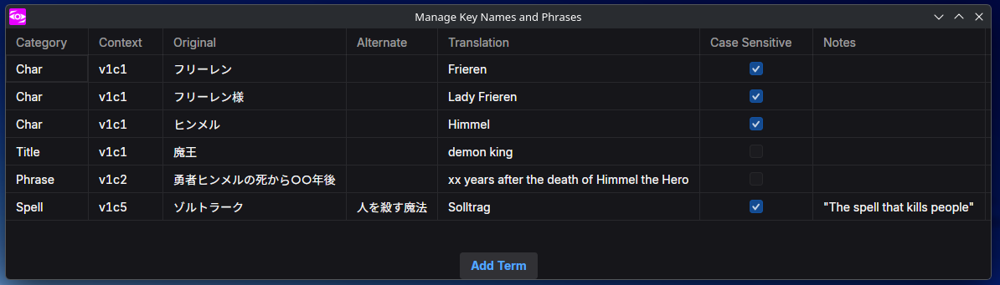

Ameko ist um Projekte herum konzipiert. Es ist zwar nicht notwendig, Projekte zu verwenden, und du kannst auch ohne sie Untertitel bearbeiten und Ameko anderweitig nutzen, aber Projekte sind dafür gedacht, die Arbeit mit mehreren Untertiteldateien zu vereinfachen, gerade, wenn man mit anderen zusammenarbeitet.

## Der Projekt-Explorer


When you first open Ameko, the Project Explorer will be on the left, listing the currently-open documents. Wenn keine Projektdatei geladen ist, dient das Standardprojekt als Ablageort für die Dateien, die du während der Sitzung öffnest. Du kannst das Projekt als Datei speichern, wenn du die Vorteile einer Projektdatei nutzen möchtest.

## Öffnen eines Ordners als Projekt

Wenn du bereits eingerichteten Projektordner hast, kannst du die Struktur in Ameko importieren, indem du den Ordner als Projekt öffnest.
Dadurch werden alle Unterordner und Untertiteldateien in den Projekt-Explorer geladen, wo du den Inhalt anpassen und das resultierende Projekt als Datei speichern kannst.

## Key Names and Phrases

Chances are, your project has names and phrases you want to keep consistent throughout the show. Projects can have a Key
Names & Phrases (KNP) bible to help keep everyone on track:



Terms that appear in the script or reference files will appear in the Editing Area. See the User Interface tab for more
details.

## Anzeigenamen und du

Zwar _können_ Projektstruktur und -namen den Dateien auf deiner Festplatte entsprechen, jedoch kannst du sie auch problemlos neu ordnen und umbenennen, ohne Auswirkung auf die zugrundeliegenden Dateien. Betrachte beispielsweise die folgende flache Hierarchie mit wortreichen Dateinamen:

```
Kono Bijutsubu ni wa Mondai ga Aru/
  [AMK] Konobi - 01 - Dialogue.ass
  [AMK] Konobi - 01 - Typesetting1.ass
  [AMK] Konobi - 01 - Typesetting2.ass
  Konobi - 01 - Captions.ja.srt
  [AMK] Konobi - 02 - Dialogue.ass
  [AMK] Konobi - 02 - Typesetting1.ass
  [AMK] Konobi - 02 - Typesetting2.ass
  Konobi - 02 - Captions.ja.srt
```

Mithilfe von Anzeigenamen kann man das innerhalb des Projektes neu organisieren und aufräumen, ohne die vorhandenen Dateien zu beeinflussen:

```
01/
  Dialogue.ass
  TS1.ass
  TS2.ass
  Captions.srt
02/
  Dialogue.ass
  TS1.ass
  TS2.ass
  Captions.srt
```

## Projekteinstellungen


Wenn man im Team arbeitet, ist einer der wichtigsten Vorteile von Projekten die synchronisierten Einstellungen. Einstellungen, die in den Projekteinstellungen getroffen wurden, werden die Einstellungen des Nutzers, wenn das Projekt geladen ist, überschreiben. So kann sichergestellt werden, dass alle dieselbe Warnschwelle für die CPS (Zeichen pro Sekunde) haben, und vor allem, um ein gemeinsames Wörterbuch zur Rechtschreibüberprüfung zu führen und sicherzustellen, dass alle dieselbe Sprache für die Rechtschreibprüfung verwenden. Wenn das Projekt also beispielsweise britisches Englisch, also „English (GB)“, als Sprache konfiguriert hat, wird _jeder_ „English (GB)“ verwenden. So wird das zusätzliche „u“ aus der britischen Schreibweise „colour“ nicht vergessen.


Sollte der Nutzer das entsprechende Wörterbuch noch nicht haben, wird er dazu aufgefordert, es herunterzuladen.


Wörter können direkt aus der Rechtschreibprüfung zum Projektwörterbuch hinzugefügt werden.

## Git-Integration


When saved in the root of a project (next to the `.git` directory), Project files allow for easy access to basic Git
functions, like commiting, pushing, pulling, and viewing a list of recent commits.
