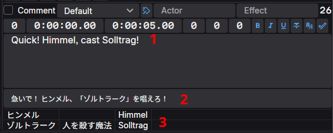

Giao diện người dùng của Ameko học hỏi rất nhiều từ Aegisub và sẽ mang lại cảm giác quen thuộc cho những người dùng Aegisub hiện tại. Dưới đây là tổng quan về giao diện người dùng của Ameko.

## Vùng Chỉnh sửa

Hầu hết người dùng có lẽ sẽ dành phần lớn thời gian ở vùng chỉnh sửa. The editing area is linked to the active
line, and consists of a large textbox for the line's text content (1), and a host of auxiliary buttons and textboxes for
adjusting the line's metadata and formatting. If a reference file is attached, the corresponding lines from the
reference will be displayed in an additional box below the main textbox (2).

If the project has any Key Names & Phrases (KNP), a grid containing matching terms will be displayed at the bottom of
the area. A term will be displayed if its Translation is present in the text content (1), or if its Original or
Alternate forms are present in the reference file lines (2).

Tóm tắt ngắn gọn về từng mục và chức năng của nó:

- Hàng trên
  - Nút bật/tắt Bình luận. Khi được đánh dấu chọn, dòng đó sẽ là một dòng bình luận và sẽ không hiển thị trên video.
  - Trình chọn Style
  - Nút chỉnh sửa Style
  - Tên nhân vật đang nói dòng đó. Không hiển thị trên video nhưng có thể hữu ích cho việc biên tập và tự động hoá.
  - Hiệu ứng sử dụng cho dòng đó. Thường chỉ dùng cho các kịch bản (script) tự động hoá.
  - Số lượng ký tự trong dòng dài nhất của phụ đề đó.
- Hàng dưới
  - Layer (Z-index). Các dòng có số layer cao hơn sẽ nằm đè lên các dòng có số layer thấp hơn.
  - Thời gian dòng xuất hiện trên màn hình
  - Thời gian dòng biến mất khỏi màn hình
  - Khoảng lùi từ lề trái của style. Đặt là 0 để sử dụng lề mặc định của style
  - Khoảng lùi từ lề phải của style. Đặt là 0 để sử dụng lề mặc định của style
  - Khoảng lùi từ lề dọc của style. Đặt là 0 để sử dụng lề mặc định của style
  - Chèn thẻ in đậm \b1 tại vị trí con trỏ, thẻ \b0 nếu văn bản đã được in đậm, hoặc cả hai nếu có bôi đen đoạn văn bản.
  - Inserts an italic `\i1` tag at the cursor position, `\i0` if the text is already italic, or both if text is
    selected.
  - Inserts an underline `\u1` tag at the cursor position, `\u0` if the text is already underlined, or both if text is
    selected.
  - Inserts a strikethrough `\s` tag at the cursor position, `\s0` if the text is already struck through, or both if
    text is selected.
  - Mở hộp thoại chọn phông chữ và chèn thẻ \fn tương ứng tại vị trí con trỏ.
  - Ghi nhận các thay đổi cho dòng này và chuyển sang dòng tiếp theo, tạo mới một dòng nếu cần.

### Menu Ngữ cảnh vùng Chỉnh sửa

Nhấp chuột phải vào bên trong hộp văn bản để mở menu ngữ cảnh.

- Mở hộp thoại kiểm tra chính tả cho dòng được chọn.
- Tách dòng thành hai tại vị trí con trỏ, với thời gian bắt đầu và kết thúc được hệ thống tự ước tính.
- Tách dòng thành hai tại vị trí con trỏ, cả hai dòng giữ nguyên thời gian bắt đầu và kết thúc như nhau.

## Lưới Phụ đề

Lưới phụ đề hiển thị tất cả các dòng trong tệp và tổng quan về metadata của chúng (thời gian bắt đầu, diễn viên, v.v.)

### Menu Ngữ cảnh Lưới Phụ đề

Nhấp chuột phải vào bất kỳ dòng nào trong lưới phụ đề để mở menu ngữ cảnh.

- Tạo bản sao của các dòng được chọn
- Gộp hai hoặc nhiều dòng lại với nhau
- Tách các dòng được chọn tại các điểm ngắt dòng \N, với thời gian bắt đầu và kết thúc được hệ thống ước tính.
- Tách các dòng được chọn tại các điểm ngắt dòng \N, với cùng thời gian bắt đầu và kết thúc.
- Chèn một dòng mới lên phía trước dòng được chọn.
- Chèn một dòng mới xuống phía sau dòng được chọn.
- Chèn một dòng mới lên phía trước dòng được chọn, bắt đầu tại thời gian hiện tại của video.
- Chèn một dòng mới xuống phía sau dòng được chọn, bắt đầu tại thời gian hiện tại của video.
- Sao chép các dòng được chọn vào khay nhớ tạm.
- Chỉ sao chép nội dung văn bản của các dòng vào khay nhớ tạm.
- Cắt các dòng được chọn vào khay nhớ tạm.
- Dán các dòng từ khay nhớ tạm.
- Dán đè (thay thế các trường) bằng các dòng từ khay nhớ tạm. Một hộp thoại sẽ hiển thị để bạn chọn trường nào cần thay thế.
- Xoá các dòng được chọn.

## Vùng Video

Khi bạn đã tải lên một video, vùng video đóng vai trò như cửa sổ xem trước và trình phát đa phương tiện. Video (và cả phụ đề của bạn!) sẽ được hiển thị ở đây trong khi bạn biên tập và phát lại thành phẩm.

Người dùng Aegisub sẽ nhanh chóng nhận ra tính năng thu phóng (zoom) của Ameko hoạt động hoàn toàn khác so với những gì họ từng quen thuộc. Thay vì thay đổi kích thước của toàn bộ vùng video theo video (làm thu hẹp phần còn lại của giao diện), Ameko chia tỷ lệ thu phóng video ở ngay bên _trong_ vùng video và cung cấp thanh cuộn để di chuyển khung hình video khi nó trở nên quá lớn. Tất nhiên, bạn cũng có thể thay đổi kích thước của toàn bộ vùng này nếu muốn dành nhiều không gian màn hình hơn cho video.

Cùng với đó, các thành phần khác nằm trong vùng video như sau:

- Hàng trên:
  - Thanh tua: Tua qua lại video
- Hàng dưới:
  - Phát/Tạm dừng: Phát đến cuối tệp hoặc tạm dừng nếu video đang phát.
  - Phát vùng chọn: Phát từ thời gian bắt đầu sớm nhất đến thời gian kết thúc muộn nhất của các dòng được chọn.
  - Bật/tắt Tự động tua: Bật hoặc tắt tính năng tự động tua đến đầu dòng được chọn. Khi tắt, nhấp đúp vào một dòng để tua video đến thời gian bắt đầu của dòng đó.
  - Dấu thời gian hiện tại (chỉ đọc).
  - Khung hình hiện tại (chỉ đọc)
  - Hiển thị độ xoay
  - Bật/tắt Khóa kích thước: Làm cho vùng video của Ameko hoạt động giống như của Aegisub (tính năng chưa được triển khai).
  - Hiển thị mức thu phóng

### Menu Ngữ cảnh Vùng Video

Nhấp chuột phải vào video để mở menu ngữ cảnh.

- Sao chép khung hình hiện tại (cả video và phụ đề) vào khay nhớ tạm.
- Sao chép khung hình hiện tại vào khay nhớ tạm; chỉ video, không có phụ đề.
- Sao chép khung hình hiện tại vào khay nhớ tạm; chỉ phụ đề, không có video.
- Lưu khung hình hiện tại (cả video và phụ đề) vào ổ đĩa.
- Lưu khung hình hiện tại vào ổ đĩa; chỉ video, không có phụ đề.
- Lưu khung hình hiện tại vào ổ đĩa; chỉ phụ đề, không có video.

## Vùng Âm thanh

Vùng âm thanh hiển thị biểu đồ sóng âm trực quan. Biểu đồ này không tự động cuộn theo video, nhưng nó sẽ tự di chuyển đến phần đầu của dòng được chọn nếu có thao tác tua (tự động hoặc thủ công).

Bên dưới biểu đồ sóng âm là thanh tua cùng các nút điều khiển, và ở bên phải là các điều khiển cho tỷ lệ thu phóng theo chiều ngang/dọc. Phần biểu đồ trực quan này chứa các thông tin sau:

- Khung hình chính: Được biểu thị bằng một đường màu xám.
- Giây và một phần tư giây: Được biểu thị bằng các vạch ngắn màu đỏ và vạch xám ngắn hơn ở mép trên và mép dưới.
- Khung hình video hiện tại: Được biểu thị bằng một đường màu đỏ.
- Vị trí âm thanh hiện tại: Được biểu thị bằng một đường màu xanh lam (chỉ hiển thị khi đang phát âm thanh).
- Các dòng phụ đề: Được biểu thị bằng một hộp màu tím bắt đầu từ thời gian bắt đầu của dòng và kết thúc tại thời gian kết thúc của dòng.

Các nút điều khiển phát lại âm thanh, theo thứ tự:

- Phát sự kiện đang chọn: Phát từ thời gian Bắt đầu đến thời gian Kết thúc. Nút này cũng đóng vai trò là nút Tạm dừng.
- Phát phía trước: Phát đoạn 500ms trước thời gian Bắt đầu của sự kiện đang chọn.
- Phát phần đầu: Phát 500ms đầu tiên của sự kiện đang chọn.
- Phát xung quanh: Phát toàn bộ thời lượng của sự kiện đang chọn, cộng thêm 500ms trước thời gian Bắt đầu và 500ms sau thời gian Kết thúc.
- Phát phần cuối: Phát 500ms cuối cùng của sự kiện đang chọn.
- Phát phía sau: Phát đoạn 500ms sau thời gian Kết thúc của sự kiện đang chọn.

## Thẻ

Ameko là một ứng dụng sử dụng giao diện thẻ (tab). Bạn có thể mở nhiều tệp phụ đề và video cùng lúc rồi tự do chuyển đổi qua lại giữa chúng. Hãy lưu ý rằng việc mở nhiều tệp video cùng lúc có thể tiêu tốn một lượng lớn RAM và/hoặc làm phần mềm mất ổn định.